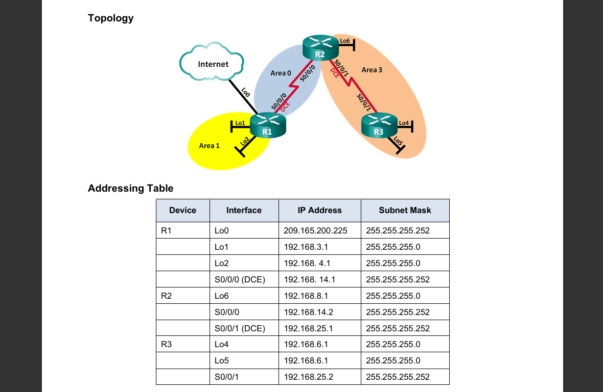
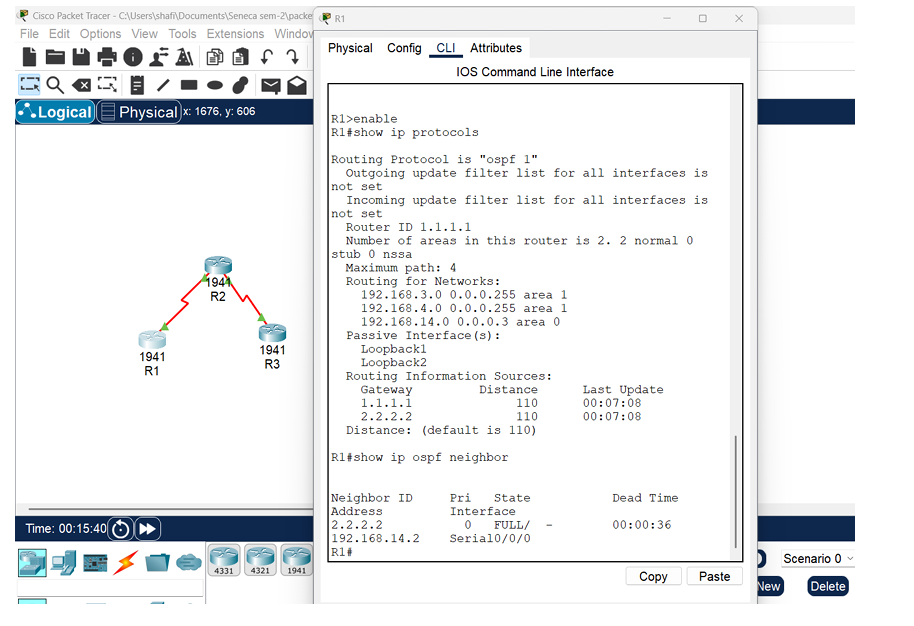
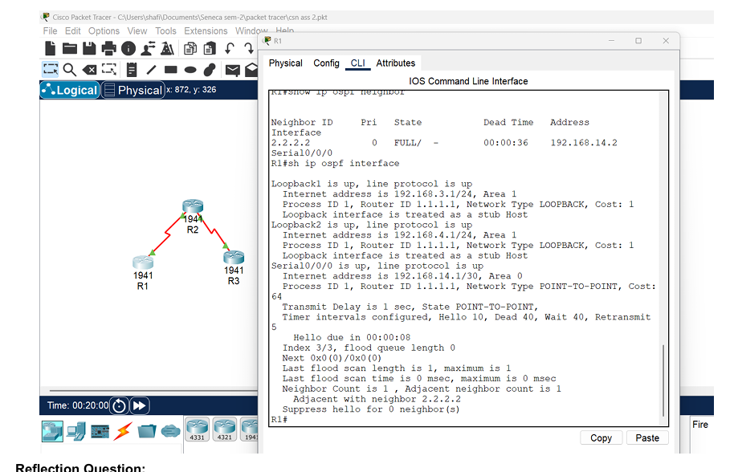

# Multi-Area OSPF Lab

This lab shows a multi-area OSPFv2 setup built in Cisco Packet Tracer. I configured three routers across different OSPF areas, assigned router IDs, set passive interfaces where needed, and verified that neighbor relationships and routing were working properly.

## Topology overview

The topology uses three routers connected across multiple OSPF areas.

- **R1** connects Area 1 to Area 0
- **R2** connects Area 0 to Area 3
- **R3** is an internal router in Area 3

This lab helped me understand how OSPF works in a bigger network and not just in a basic single-area setup.



## What I did

First, I configured the routers and assigned the correct OSPF areas. I also set router IDs and made the loopback interfaces passive where needed.



After that, I verified that the routers were forming OSPF neighbor relationships properly and that routing between areas was working.



## Key concepts shown

- multi-area OSPFv2
- router IDs
- passive interfaces
- OSPF neighbor adjacencies
- routing between multiple areas

## What I learned

This lab helped me understand OSPF better, especially how it works across multiple areas instead of just one network. It also gave me more practice with checking neighbor relationships and making sure the routing was configured properly.

## Commands used

```bash
show ip protocols
show ip ospf neighbor


